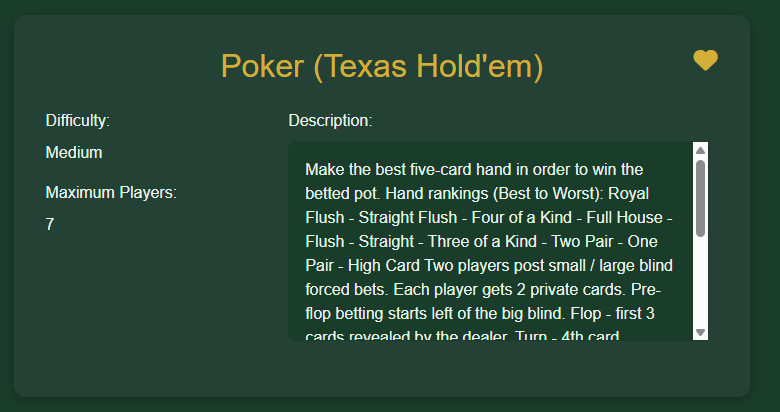
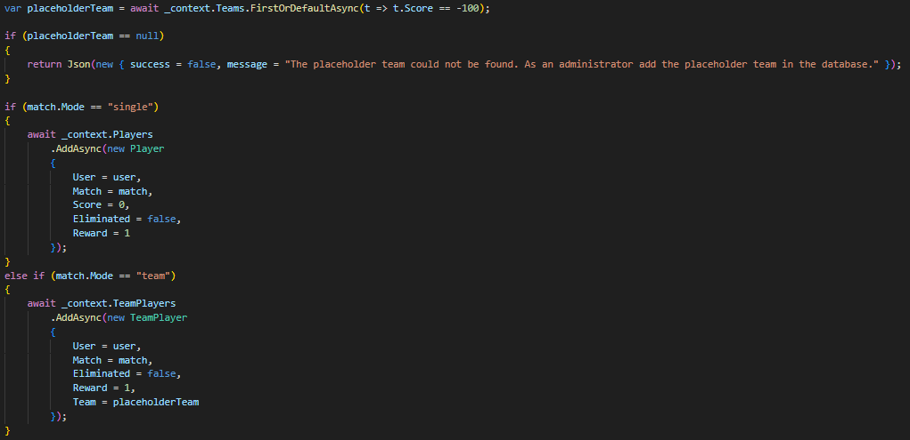
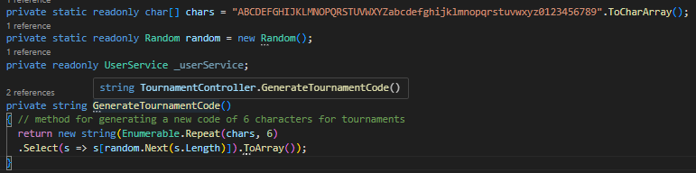

# TrackMyScore - Web Application

Welcome to the **TrackMyScore** web application. This project provides a modern solution for managing multiplayer board games, including user profiles, game rooms, tournaments, and performance statistics.

---

## 🏠 Home Page

Authenticated users are greeted with a welcome message and the latest updates from the platform.

---

## 📅 Registration

New users can register through a dedicated form requiring unique credentials (username, email) and secure passwords (minimum 8 characters, match confirmation).

Passwords are encrypted using **PBKDF2** with:

* Iterations (for brute-force resistance)
* Random salt (ensuring unique hashes)
* Secure storage of all encryption components

---

## 🔐 Login

Users can log in with valid credentials. "Remember Me" support is provided via browser cookies. Password validation uses the same cryptographic process as during registration.

---

## ⟳ Password Reset

Forgot your password? Submit your email to receive a randomly generated 8-character temporary password.

---

## 🔍 Search Page

A top navigation bar includes a search bar to find other user profiles. Minimum 1 character is required for suggestions based on username matches.

---

## 👤 Player Profile

The profile page displays user details, match/tournament history, stats, followers/following, and added games. Users can edit their own profile or follow/unfollow others.

---

## 🎮 Games Page

Three categorized game lists are displayed:

1. Personalized Recommendations (based on favorite similarity with 70%+ overlap)
2. Official Games (admin added)
3. User-Added Games

Users can:

* Add new games
* View detailed game info
* Admins can approve/remove games or make them official

---

## 🏋️‍♂️ Matches

View available and joined matches. Create a match by choosing type (Single or Team), configure players and settings.

### Match States:

* -1: Waiting
* 0: Active
* -2: Finished

---

## 🏆 Tournaments

Players can join tournaments using a unique 6-character code. Tournaments can be "Single" or "Team" and host 2 to 16 starting matches.

Admins or hosts:

* Configure participants
* Monitor stages
* Advance winners
* Finalize results

### 🧬 Respect Points System

* All players start with 1 point
* Advancing to the next stage: double points
* Eliminated players receive their current points
* Winner gets the accumulated points

---

## 👷‍♂️ Admin Panel

Admins can:

* View app statistics
* Manage official games
* Monitor users and matches

---

## 🏁 Summary

This web app makes it easy to manage player profiles, games, matches, and tournaments, all while keeping accounts secure and adding fun features like following other players and earning respect points. It's a great fit for both casual board game fans and competitive communities.
